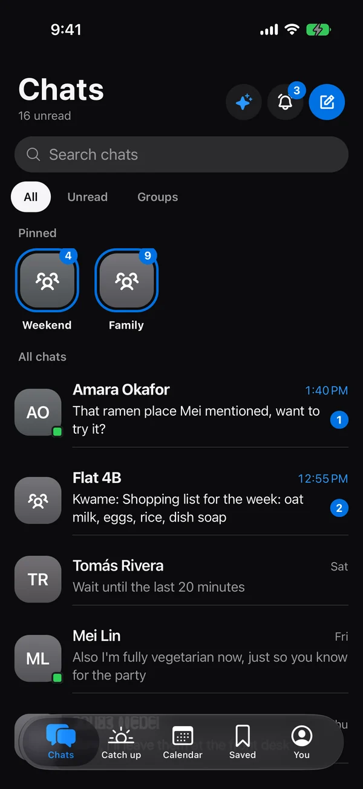
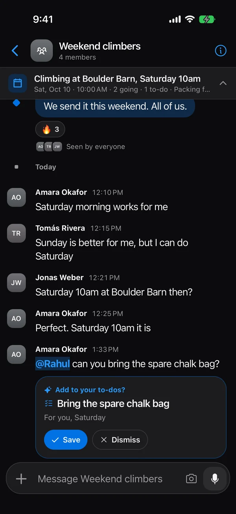
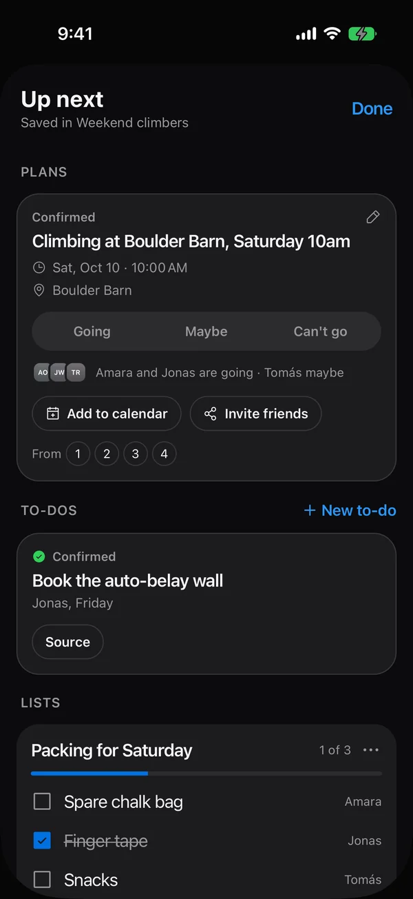
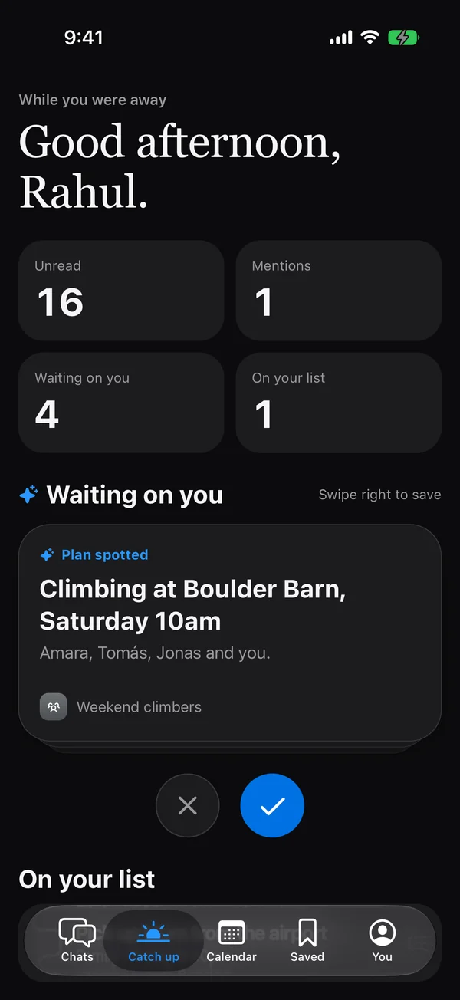

# Lynk

A private group chat for friends and family that remembers the plan.

When a group agrees on a time and place, Lynk turns it into a plan with RSVPs and pins it at the top of the chat, next to the group's to-dos and lists. Every chat is end-to-end encrypted, and the smart features run on your own device. Lynk starts in India, so you sign in with your phone number (+91 by default).

<p>
  
  
  
  
</p>

**Status:** the web app and the iPhone and Android app are built and run on realistic sample data. There is no backend yet; it is designed in [`roadmap.html`](roadmap.html) (v5.5).

## What it does

- **Plan spotting.** When messages settle on a day, a time and a place, a "Save this plan?" card appears under them. Asks aimed at you become to-do suggestions. Nothing is saved without a tap.
- **Up next.** Every chat has a pinned bar with the next plan, who's going and what's left to do. Tap it to RSVP, add the plan to your calendar, tick off to-dos, make new ones, edit lists and see pinned messages without leaving the chat.
- **Getting people there.** One tap asks the people who haven't answered a plan, and you get a reminder an hour before plans you're going to. Invite friends who aren't on Lynk with a link where they can answer.
- **Polls and weekly plans.** Ask "Friday or Saturday?" and turn the winner into the plan; plans can repeat every week, with answers for each date.
- **First run.** A new account can watch a 30-second demo chat where Lynk spots a plan.
- **On iPhone:** a home-screen widget with your next plan, and the app in English or हिन्दी.
- **Catch up.** Everything waiting on you across all chats, with suggestions dealt as a deck of cards: swipe right to save, left to dismiss.
- **Ask Lynk.** Ask "where did Mei say that ramen place was?" and get an answer that cites the message it came from.
- **Calendar.** Every plan from every chat on one month grid, exportable as `.ics`.
- **iPhone Duo.** Fully open, the inner display is one full-width screen. Partly folded, the chat list and the conversation sit on either side of the fold, and every other tab splits the same way.
- **Also:** side chats, shared lists, saved messages, voice notes with transcripts, translation, an offline outbox, and memories you can edit or remove.

## Privacy

- Every chat will be end-to-end encrypted with MLS (OpenMLS), with no setting to turn it off. The server only relays and stores ciphertext.
- Search, plan spotting, transcripts and translation run on the device, over messages already decrypted there.
- Friends find you by @username and never see your phone number.
- Today, before the server exists: the phone app keeps chats in a SQLCipher database keyed from the iOS Keychain or Android Keystore, and the web app encrypts its store with a non-extractable WebCrypto key.

## Repository layout

| Folder | What it is | Status |
| --- | --- | --- |
| `apps/web` | Next.js web app and landing page | Built, on sample data |
| `apps/mobile` | Expo app for iPhone and Android | Built, on sample data |
| `design-system/lynk` | Design system (`MASTER.md`) shared by every app | Active |
| `docs/screenshots` | Screens used in this README | |
| `roadmap.html` | Product and engineering roadmap | v5.5 |

The phone app imports the web app's chat logic (`apps/web/src/lib`: plan spotting, search, notifications, calendar export, phone-number rules) through the `@shared/*` path, so both apps behave the same.

## Licence

All rights reserved; see [`LICENSE`](LICENSE). You are welcome to read the code, but not to reuse it without permission.

## Docs

- [`docs/ARCHITECTURE.md`](docs/ARCHITECTURE.md): how the apps are built, the shared logic layer, storage, key flows and the planned server
- [`docs/DECISIONS.md`](docs/DECISIONS.md): product and technical decisions, and why
- [`CONTRIBUTING.md`](CONTRIBUTING.md): checks before committing, commit style, and which docs to update when
- [`roadmap.html`](roadmap.html): phases, schema, protocol, encryption design and risks

## Run the web app

```bash
cd apps/web
npm install
npm run dev
```

Open http://localhost:3000 and sign in with **+91 98765 43210**. No text is sent in the preview: any 6 digits work as the code.

## Run the phone app

Needs Xcode (for iPhone) or Android Studio (for Android). See [`apps/mobile/README.md`](apps/mobile/README.md) for details.

```bash
cd apps/mobile
npm install
npx expo run:ios        # or: npx expo run:android
```

Sign in with the same number and any 6 digits.

## Tests

A [Maestro](https://maestro.dev) flow drives the phone app on a simulator: it signs in with a +91 number, sends "Dinner Friday 8pm at Nando's?", checks the plan suggestion, opens Up next and Ask Lynk, and visits every tab.

```bash
cd apps/mobile
maestro test .maestro/smoke.yaml
```

## Built with

Next.js 16, React 19, Tailwind 4 and Motion on the web; Expo SDK 57, React Native 0.86, Expo Router and the React Compiler on phones; TypeScript throughout. The planned backend is a Go modular monolith with PostgreSQL, Redis and NATS (see the roadmap).
