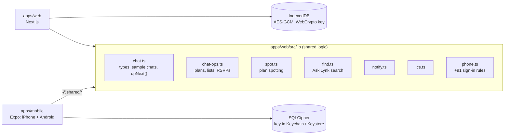

# Architecture

How Lynk is built today, and where the planned server fits. For the product plan, phases and the full encryption design, see [`roadmap.html`](../roadmap.html). For why things are the way they are, see [`DECISIONS.md`](DECISIONS.md).

_Last updated: 4 Oct 2026 (roadmap v5.5)._

## Today at a glance

Two frontends, one set of rules, no server yet.

- **Everything runs on the device.** Accounts, chats, plans and lists are sample data stored locally. Sending, replies, delivery ticks and SMS codes are simulated.
- **The phone app imports the web app's logic** instead of copying it, so a plan spotted on the web is spotted the same way on a phone.
- **Nothing leaves the device.** There are no network calls apart from loading the web app itself.

## Repository map

| Path | What it is |
| --- | --- |
| `apps/web` | Next.js 16 web app and landing page (React 19, Tailwind 4, Motion, Phosphor icons) |
| `apps/web/src/lib` | Shared logic used by both apps, plus web-only helpers |
| `apps/mobile` | Expo SDK 57 app for iPhone and Android (React Native 0.86, Expo Router, React Compiler) |
| `design-system/lynk/MASTER.md` | Colours, type, spacing and component rules for every app |
| `docs/` | This file, the decision log, README screenshots |
| `roadmap.html` | Product and engineering roadmap |

## The shared logic layer

These modules in `apps/web/src/lib` are imported by both apps. The phone app reaches them through the `@shared/*` path (`apps/mobile/tsconfig.json`) and a Metro `watchFolders` entry (`apps/mobile/metro.config.js`).

| Module | What it owns |
| --- | --- |
| `chat.ts` | Types (`Chat`, `Message`, `Decision`, `Task`, `SharedList`, `Memory`, `SideChat`), the sample chats and people, formatting (`formatWhen`, `rsvpSummary`), `allPlans()`, `upNext()` / `upNextSummary()` / `upNextTitle()` for the Up next bar, `nudgeText()` for asking who hasn't answered, `remindable()` / `reminderText()` for plan reminders, `rollRepeats()` (weekly plans move to their next date with fresh RSVPs; `allPlans()` also lists their next eight weeks), `smartIn()` (your smart settings, unless one chat turns suggestions off), polls on messages (`Message.poll`), and the first-run `DEMO_SCRIPT` |
| `chat-ops.ts` | Pure changes to a chat: plans, RSVPs, to-dos made by hand (`addTask`), pinned messages (`togglePinned`), poll votes and closing a poll into a plan (`vote`, `decidePoll`), per-chat suggestions (`setChatSmart`), lists, memories, side chats, saved messages |
| `spot.ts` | Plan spotting by rules: a message needs a day and a time to become a suggestion. `planFromPoll()` reads the date from a poll's winning option and the place from its question |
| `plan-link.ts` | Plan invite links for people not on Lynk: the plan travels in the link's fragment (after `#`), which never reaches a server, and `planInviteText()` writes the message that goes with it |
| `i18n.ts`, `i18n-hi.ts` | The app's own text in English or Hindi: `t("English text", vars)`, keyed by the English wording so anything untranslated stays English; `locale()` gives Hindi date formats. The phone app sets the language; the web stays English for now |
| `find.ts` | Ask Lynk: keyword search with synonyms, answers that cite their source messages |
| `notify.ts` | The one rule for what deserves a notification, and grouping for the notifications list |
| `ics.ts` | Calendar files (RFC 5545) for one plan or all of them; weekly plans get `RRULE:FREQ=WEEKLY` |
| `phone.ts` | Phone number rules: +91 default, normalising Indian numbers, validation, the mock code check |

**Rule for this layer:** keep it free of DOM, React Native and storage APIs, so it runs in both apps. `account.ts` is web-only; the phone app imports only its types.

## Web app (`apps/web`)

**Routes** (App Router, `src/app`):

| Route | Screen |
| --- | --- |
| `/` | Landing page |
| `/sign-in`, `/sign-up` | Phone number and code; sign-up adds name and username first |
| `/app` | Chat list, conversation (`?chat=<id>`, side chats as `<id>~<side>`), Catch up when no chat is open |
| `/app/calendar` | Every plan on a month grid, `.ics` export |
| `/app/saved` | Saved messages |
| `/app/profile`, `/app/people/[id]` | Your profile, a contact's profile |
| `/app/settings/[pane]` | Account, Sign-in & security, Privacy, Notifications, Smart features, Appearance, Your data |
| `/invite/[code]`, `/privacy` | Invite links, plain-language privacy page |
| `/p#<plan>` | A plan invite for people not on Lynk: the plan, read from the link on the device, and Going / Maybe / Can't go with just a name (a preview: the answer isn't sent anywhere yet) |

**State:**
- `components/chat/ChatApp.tsx` holds the chat state in a `useReducer` and hands callbacks down to `Thread`, `ContextPanel`, `UpNext` and `CatchUp`.
- `lib/chat-store.ts` saves chats per username through `lib/secure-store.ts`: AES-256-GCM in IndexedDB, under a non-extractable WebCrypto key.
- `lib/account.ts` keeps the account and settings in `localStorage` with `useSyncExternalStore`. Its shape mirrors what the API will return.

**Web dialogs:** `PlanDialog` (with Every week), `TaskDialog` (a to-do by hand) and `PollDialog` are owned by `ChatApp`, which also runs the minute tick: the in-tab plan reminder check and `rollRepeats()`. `ChatApp` also starts the first-run demo group from the empty inbox. Plan cards carry Invite friends (the share sheet, or copy plus WhatsApp).

**Web-only helpers:** `voice.ts` (recording, waveform, on-device speech recognition), `translate.ts` (Chrome's on-device translator or sample translations), `attachments.ts`, `connection.ts` (online state plus a simulated offline switch), `invites.ts`, `theme.ts`.

## Phone app (`apps/mobile`)

**Routes** (Expo Router, `src/app`):

| Route | Screen |
| --- | --- |
| `welcome`, `sign-in`, `sign-up` | Signed-out flow (`Stack.Protected` in `_layout.tsx`) |
| `(tabs)/` | Native tabs: `chats`, `catch-up`, `calendar`, `saved`, `you` |
| `chat/[id]` | Conversation (`components/chat/ChatView.tsx`) with the Up next bar; side chats use the same route |
| `chat-info/[id]`, `ask`, `notifications`, `new-chat`, `plan`, `todo`, `poll` | Modals and sheets (`todo` makes a to-do by hand, `poll` asks a poll; `plan` takes Every week) |
| `person/[id]`, `settings/[pane]` | Contact profile, the seven settings panes |

**State and storage:**
- `lib/store.ts` is the global chat store (`useSyncExternalStore`). It covers sending with a delivery lifecycle, simulated replies, the offline outbox (`flushOutbox` on reconnect), plan spotting on send, and every chat action.
- `lib/storage.ts` opens `lynk.db` with SQLCipher. The key is 32 random bytes kept in expo-secure-store (`WHEN_UNLOCKED_THIS_DEVICE_ONLY`). Data sits in one key-value table, written through a queue.
- `lib/account.ts` has the same account shape as the web, plus `appearance` and `language` (English or हिन्दी, Settings › Appearance), stored in the encrypted database. `_layout.tsx` sets the language for `t()` and remounts the stack when it changes; `Text` gives Devanagari more line height.
- `lib/store.ts` also starts the first-run demo group (`startDemo`), sends polls with simulated votes (`sendPoll`) and rolls weekly plans on a minute `tick()`.
- `lib/widget.ts` hands the home-screen widget (`widgets/NextPlan.tsx`, built with `expo-widgets` and `@expo/ui` SwiftUI views) a timeline of your next plans, so it moves on by itself; tapping it opens the plan's chat (`lynk://chat/<id>`).
- `lib/reminders.ts` schedules a local notification an hour before each timed plan you said Going or Maybe to. `_layout.tsx` reschedules them whenever the chats change and opens the chat when one is tapped. Permission is asked from `PlanCard` (on Going or Maybe) and the plan sheet, never on launch. Granting it reschedules at once (the chats changed while the prompt was up), and reschedules run one at a time so none are scheduled twice.

**iPhone Duo** (HIG: `designing-for-iphone-duo`):
- `components/FoldSplit.tsx`: one full-width screen, split into two panes only while the Duo is partly folded, one on each side of the fold with a gap its width. Used by Chats (list and conversation), Catch up, Calendar, Saved and You. The fold is shared by every mounted screen, so hidden tabs switch with it. Folding animates on the screen in view (Reanimated layout animations: the panes slide apart, the single screen fades); screens out of view or just coming into view switch without animating.
- `modules/fold-regions`: a local Expo module whose native view reports UIKit's reserved regions (`UIView.reservedRegions(kind:)`, iOS 27.1+): the fold (`division`, with an `active` flag) and the cameras (`occlusion`). Elsewhere it's a plain View.
- `lib/layout.ts`: `useTopMargin()` adds 28pt at the top when no status bar sits there (the Duo, whose status bar is on the side). `selectChat()` holds the chat open in the right pane, so it survives unfolding.
- `components/SideSafe.tsx`: keeps content clear of the left and right safe areas, where the Duo puts its status bar, camera and tab bar. The root `Stack` applies it to every screen through `screenLayout`; the tab screens wrap themselves. React Native `Modal`s sit outside both, so each one (Up next, the phone-number sheet, the message menu, the photo viewer) keeps clear of the side areas itself.
- Tab screens use `contentInsetAdjustmentBehavior="automatic"`, so iOS adds bottom space only where the tab bar actually is. Unfolding or closing the Duo with a chat open in the right pane opens that chat full screen.

**Native setup** (all in config, no hand-edited `ios/` or `android/`):
- `plugins/with-scene-lifecycle.js`: adopts the scene lifecycle iOS 27 requires.
- `plugins/with-quoted-bundle-script.js` and `patches/expo-constants+*.patch`: fix build scripts that break on a space in the project path.
- `app.json`: bundle id `com.rahulgandhi.lynk`, icon, splash, any orientation (the Duo's poses need it), and plugin settings (SQLCipher on, microphone and photo permissions, `expo-notifications` for plan reminders).
- `modules/fold-regions`: autolinked local module (see above). It needs an iOS 27.1+ SDK to build.
- `expo-widgets` adds the `ExpoWidgetsTarget` extension for the Up next widget (small, medium and Lock Screen). `patches/expo-widgets+*.patch` quotes its bundle script, which also broke on the space in the path.

## Key flows

**Sending a message.** The message appears at once. It is marked "Waiting to send" when offline, and the outbox sends it in order on reconnect. The message id doubles as the idempotency key, so a retry never sends twice.

**From message to plan.**
1. `spot.ts` finds a day and a time in a message you sent (sample chats come with suggestions already).
2. It adds a `Decision` with `status: "proposed"`, which shows as a "Save this plan?" card under the source message and in Catch up's deck.
3. Saving sets `status: "confirmed"`. Plans take RSVPs and appear in the calendar.
4. `upNext()` picks confirmed plans that haven't happened, open to-dos, lists with unticked items and pinned messages, and the Up next bar shows them. From the bar you can make a to-do, unpin a message, or ask the people who haven't answered a plan (`nudgeText()` posts it as your message).
5. An hour before a timed plan you're going to, a reminder goes off: a local notification on phones, a browser notification on the web while Lynk is open.

**Signing in.**
1. `phone.ts` normalises the number (`98765 43210` becomes `+919876543210`) and checks it.
2. `sendCode()` and `checkCode()` stand in for the server; any 6 digits pass.
3. Sign-in only works for the number stored on the account, and sign-up stores the new number.

## Security today vs planned

| Area | Today | Planned (roadmap phase 1) |
| --- | --- | --- |
| Messages in transit | No network: all local | MLS (RFC 9420) via OpenMLS on every client; server sees ciphertext only |
| Messages at rest | SQLCipher (phone), AES-GCM IndexedDB (web) | Same, plus encrypted backups keyed from a PIN or recovery code |
| Sign-in | Mock phone number and code | SMS codes (DLT-registered in India), rate limits, registration-lock PIN |
| Smart features | Rules and samples on the device | On-device models where available; never server-side |

The app already says every chat is end-to-end encrypted. The encryption itself arrives with the server.

## Planned server

A Go modular monolith (`apps/server`), one binary in three roles: `api` (HTTP and WebSocket), `worker` (push, media) and `relay` (outbox to NATS). Behind it: PostgreSQL for accounts, memberships and the ordered encrypted event log per chat; Redis for presence and rate limits; NATS JetStream for fan-out; S3-compatible storage for encrypted media. The schema, event protocol and reconnect rules are in the roadmap's Schema, Protocol and Encryption sections.

When it lands, the client-side stores become caches of the server's event log, and `chat-ops.ts` changes become encrypted events with the same shapes.

## Testing

- **Type-check and lint** in each app: `npx tsc --noEmit`, then `npm run lint` (web) or `npx expo lint` (mobile).
- **Web production build:** `npm run build` in `apps/web`.
- **UI test:** `apps/mobile/.maestro/smoke.yaml` drives the real app on a simulator: sign-in with +91, a group chat, plan spotting, saving the plan, nudging, pinning a message, a to-do by hand, Up next, chat info, Ask Lynk and every tab. `plans.yaml` (run after it) asks a poll, turns the winner into a weekly plan and checks Up next.
- **iPhone Duo:** test on the iPhone Duo simulator (iOS 27.1 runtime) in Device Hub. Maestro only drives the outer display; capture the inner one with `xcrun simctl io <device> screenshot --display=internal`. Change poses in Device Hub.
